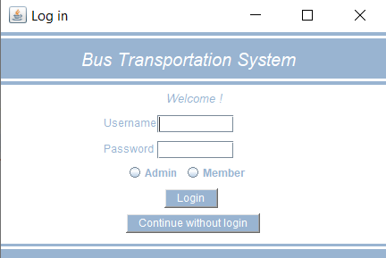
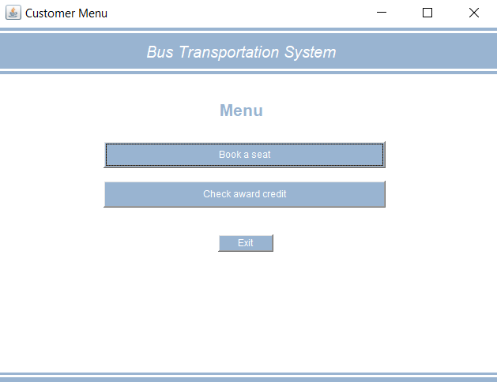
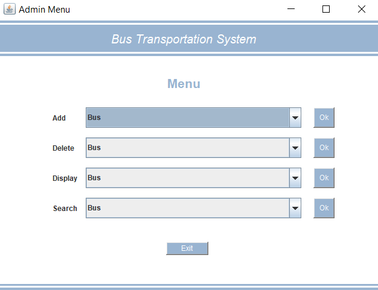
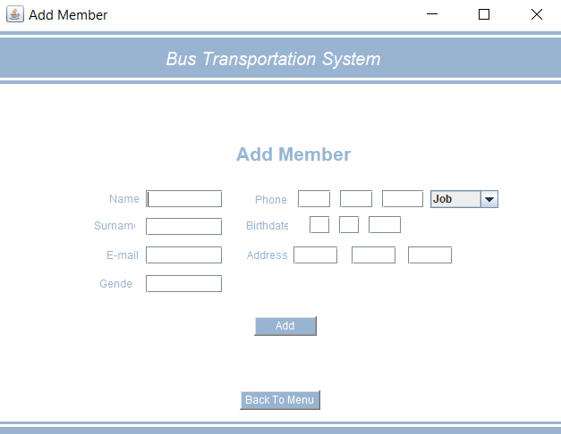
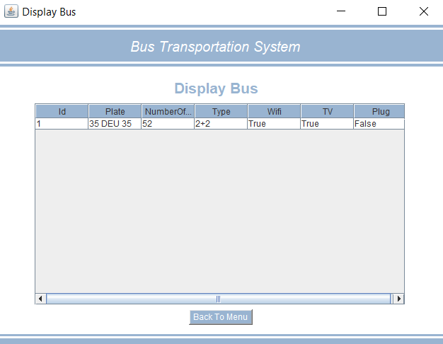

# Bus Management System

- The purpose of the project is to design a management system for an intercity bus company that has several offices in different cities. 
- Administration is able to add/delete new vehicles, employees, offices or edit trips.
- Members or non-member costumers can search for trips and book tickets.
- Java Swing package is used for Interfaces.
- User Interface :

